- [Introducción](#introducción)
- [Integrantes](#integrantes)
- [Interfaz](#interfaz)
  - [Entrada](#entrada)
- [Responsabilidades](#responsabilidades)
    - [Tobias Quiró Franco](#tobias-quiró-franco)
- [(Cumplido)](#cumplido)
- [(Cumplido)](#cumplido-1)
    - [Juan Ignacio Nicolet](#ignacio-nicolet-juan)
- [(No cumplido, se sigue investigando)](#no-cumplido-se-sigue-investigando)
  - [Juan Pablo Rodrigues](#pablo-rodrigues-juan)
  - [Estado actual del proyecto:](#estado-actual-del-proyecto)

  
## Introducción

Este proyecto tiene el siguiente objetivo: 
Lograr una aplicación utilizando el hardware del dispositivo móvil para la gestión de información, enfocada en la experiencia de usuario.
El enfoque va a estar dado por los usuarios de un RESTAURANTE, el cual apunta todos sus esfuerzos en mejorar la utilización de su servicio por medio de una aplicación para celulares.

## Integrantes
- Tobias Quiró Franco
- Juan Ignacio Nicolet
- Juan Pablo Rodrigues

## Interfaz

Logo

### Entrada

Al entrar a al aplicación se verá una pantalla de carga con el nombre de los integrantes del grupo y la división del curso

---

Cuando termine de cargar, se podrá ver la pantalla de inicio de sesión con un campo para introducir correo electrónico y otro para introducir la contraseña.
También hay 2 usuarios por cada tipo de perfil: Dueño - Supervisor - Empleado - Cliente 

---

Si se ingresa como Dueño se podrán ver dos botones, uno para registrar nuevos empleados y uno para registrar nuevos clientes

--- 

En la sección del registro de emplados se pueden registrar nuevas cuentas de empleados

---

una vez se ingresa como dueño se va a poder 3 opcciones

cuando se ingresa a la ultima opcion vamos a poder ingresar una nueva comida

---

una vez se ingresa como bartender se va a poder 3 opcciones

cuando se ingresa a la ultima opcion vamos a poder ingresar una nueva bebida

---

una vez se ingresa como dueño vamos a poder ver en una de las opciones una de ellas con un logo de una mesa

una vez entramos vamos a poder crear una nueva mesa

---

Para registrar un cliente registrar en el inicio de la aplicacion vamos a ver un crear cliente

Una vez nos metemos vamos a poder crearlo

Cuando el cliente es creado queda a la espera de ser aceptado o rechazado

---

El dueño o el supervisor va a poder tanto aceptar como rechazar a el cliente, ademas de que una vez el cliente registrado les llegaria una notificacion

Se podra rechazar como confirmar acceso

Si el cliente es rechazado le llegara un mail notificandolo

Si es aceptado de igual manera

---

Otra opción para ingresar al sistema es con el botón de acceso rápido del cliente anónimo en el inicio de sesión

---

Al ingresar como cliente se verá la foto y el nombre de cliente en una barra de navegación, un botón para solicitar mesa y un botón para cerrar sesión

---

Si se solicita una mesa se llevará al cliente a una pantalla en donde debe esperar que se le asinge una. Mientras tanto puede ver los resultados de encuestas previas a través de un botón

---

Mientras tanto al maitre le llega una notificación de que se solicitó una mesa y este le asinga su respectivo lugar

---

Dentro de esta interfaz las mesas ocupadas no pueden ser seleccionadas ya que ya fueron ocupadas. Pero las otras mesas pueden ser asignadas

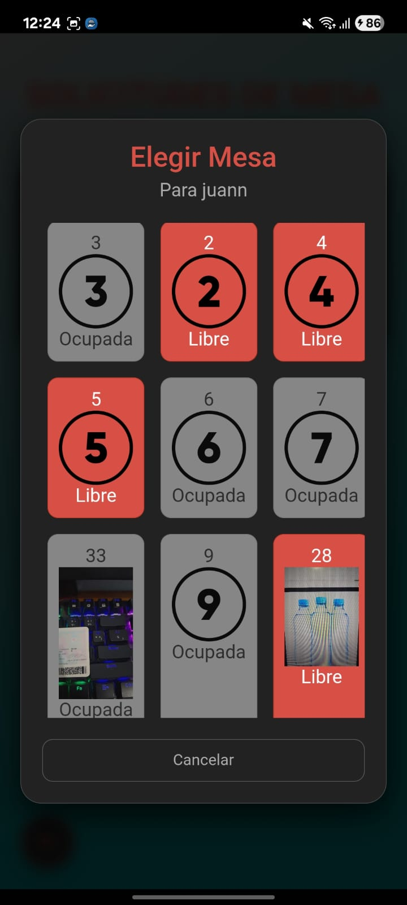

---

Automáticamente se le informa la cliente su mesa y se le da la opción de escanear las mesas. 

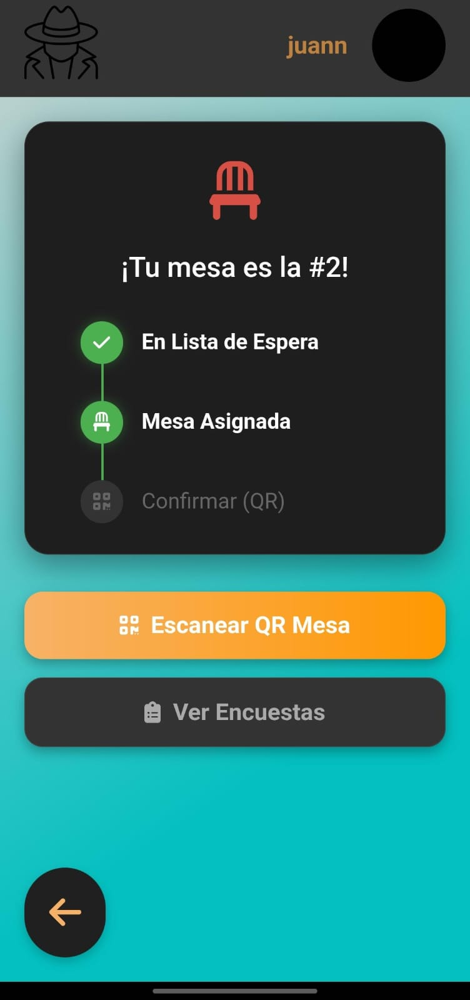

Si se escanea una mesa a la cual no es la asignada le mostrara un mensaje diciendole que la mesa es incorrecta

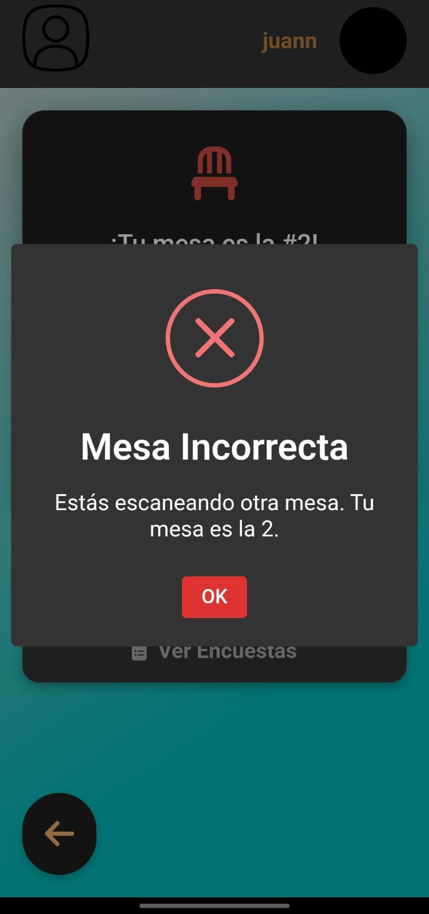

---

Al escanearse correctamente el cliente puede ver el listado de productos

---

Si el cliente utiliza el botón del chat podrá entrar en contacto directo con los meseros

CAMBIAR

---

Cuando se envia el mensaje le llega la notificación a los meseros

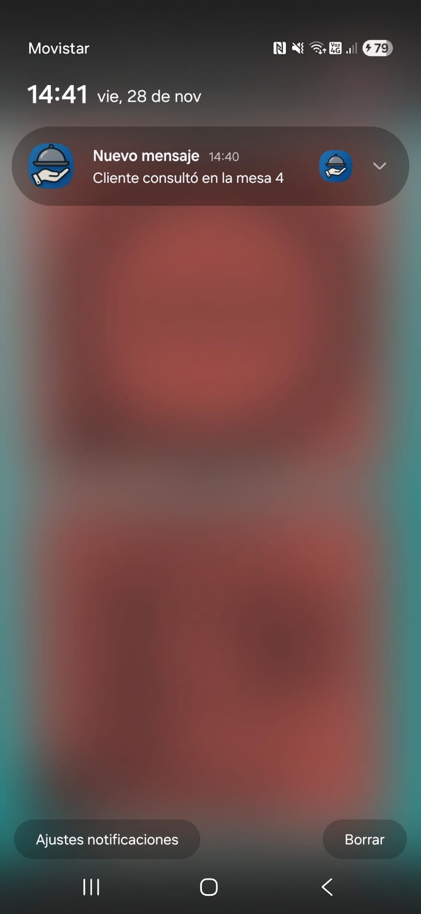

---

Al ingresar como mesero se puede utilizar un botón para contactar con la mesa o al presionar el botón de la notificación se lo lleva a la mesa especifica

---

Al mesero contestar el mensaje que habia mandado antes el cliente recibira una notificacion de que el mesero respondio su consulta

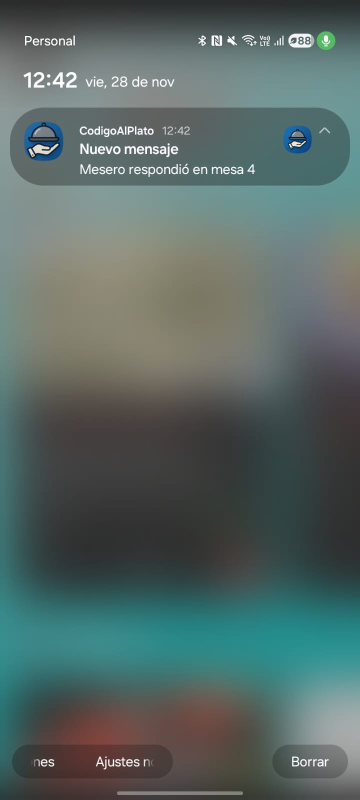

---
El cliente, una vez en la carta puede seleccionar los productos que quiere para sus pedidos y ordenarlos una vez que esté listo. Mostrandose el total a pagar y el tiempo total estimado de espera

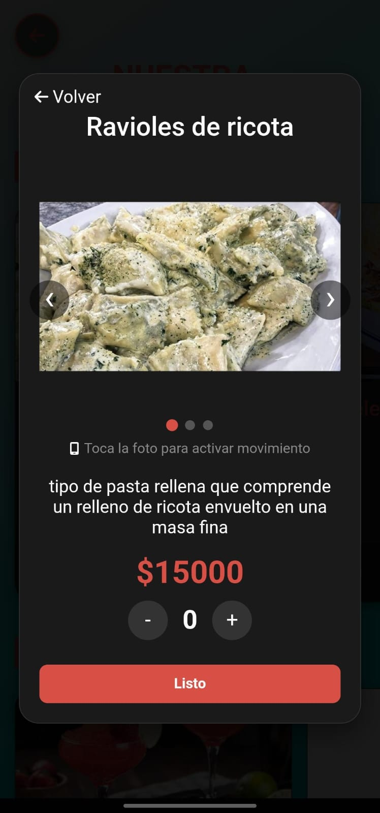

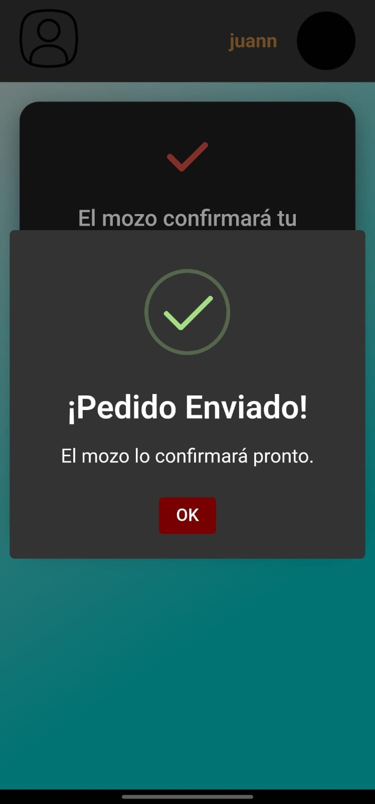

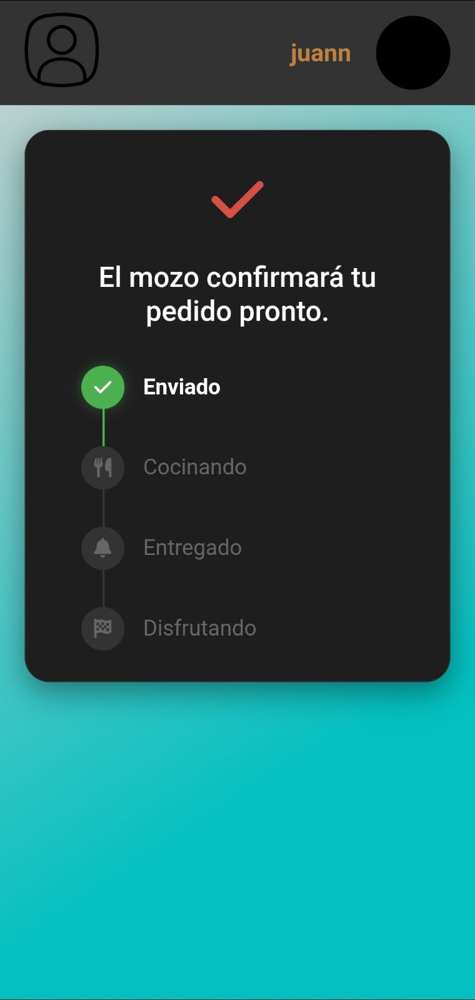

---

Una vez hecho el pedido, el mesero recibira una notificacion en la cual esta avisa que el cliente realizo un pedido

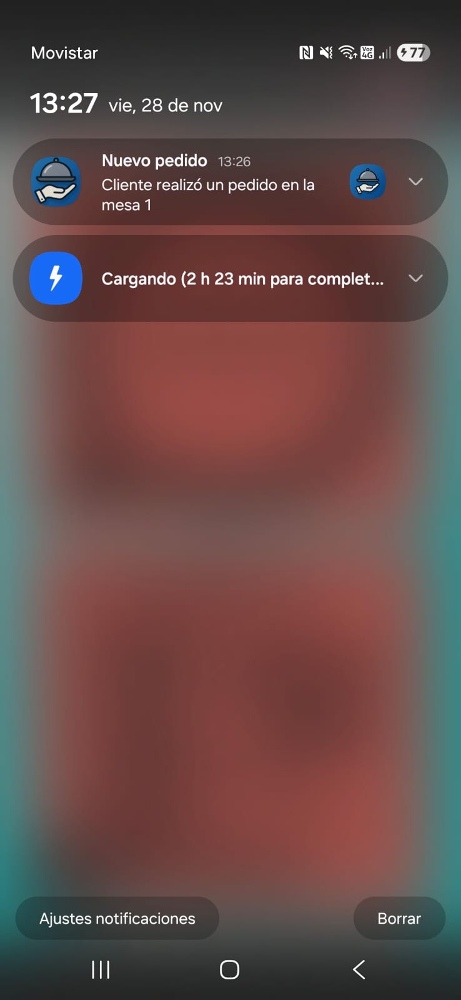

Este pedido puede ser rechazado como aceptado

Si rechaza el pedido, el mesero va a escribir por que la rechaza

PONER FOTO

---

Una vez es rechazado se le va a notificar al cliente por una notificacion y se lo va a mostrar por la pantalla

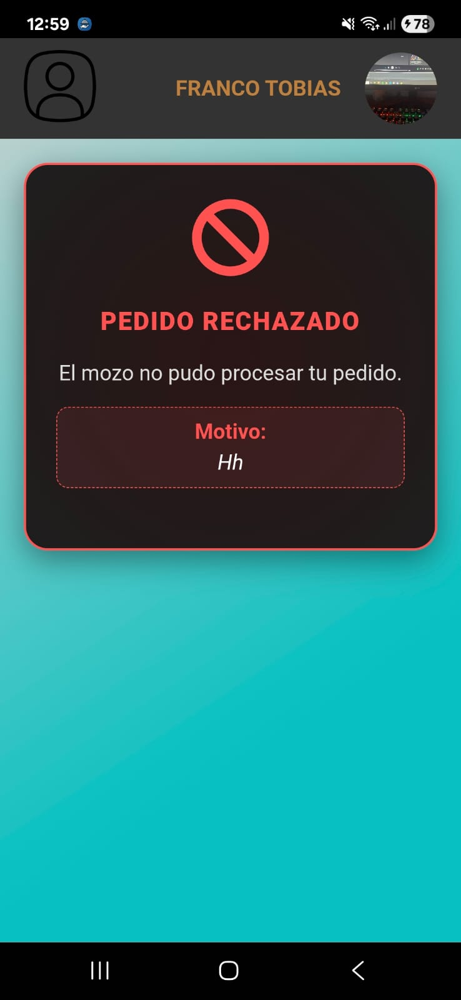

---

Cuando se toque la notificacion el cliente va a poder volver a pedir un pedido ya que es enviado directamente a la carta

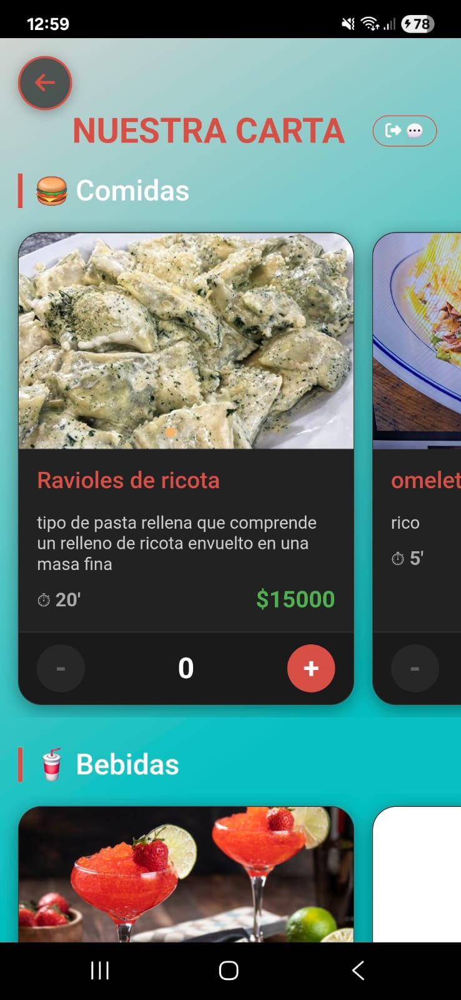

---

Ahora el mesero va a aceptar su pedido

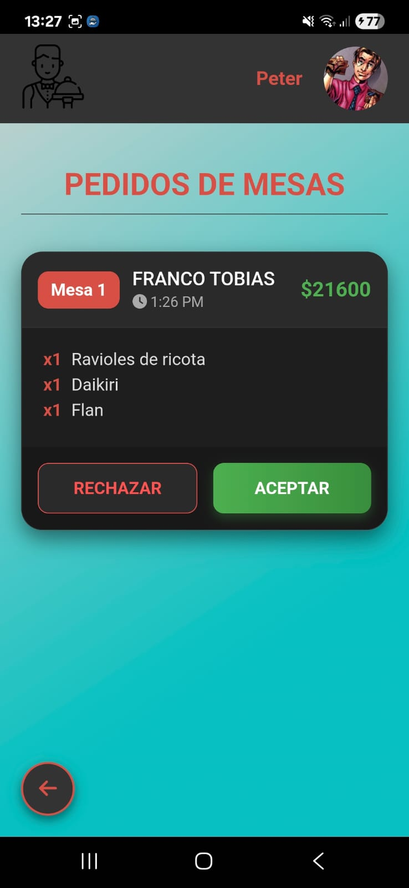

---

Una vez confirmado el pedido se le cambiara la espera al cliente, se le habilitara los juegos mientras espera el pedido y tambien se habilita un boton para ver el pedido todo el tiempo

---

Los juegos sirven para obtener una descuento, tenemos cuatro juegos diferentes

Ahorcado

---

Menos o Mas

---

Juego kinetico de super heroes

---

Juego del punto extra, mesero tiene que llegar a la mesa

Una vez confirmado el pedido le llegarán las respectivas notificaciones a los cocineros y bartenders los cuales una vez que realicen sus actividades notificarán su finalización para que le mesero las entregue

---

---

Cuando AMBAS estaciones confirmen el pedido le llegará una notificación al mesera la cual indicará que ya se puede entregar el pedio y este completa el proceso.

---

Al cliente se le notifica que el pedido ha sido entregado y confirma su recepción lo que lo lleva a una pantalla en donde puede completar la encuesta y pedir la cuenta

---

Al pedir la cuenta, utiilizando el botón le llegará una notificación al mesesero y al presionarla este podra entregarsela al cliente.

El cliente una vez pide la cuenta el va a ver como la cuenta fue solicitada y una vez la cuenta fue entregada va a mostrarse la cuenta automaticamente

--- 

Al pagar la cuenta se lo envía al cliente al home mientras el mesero confirma el pago

--- 

Finalmente al confirmar el pago se le envia al cliente por mail la factura de su cuenta

---

Ahora podemos iniciar sesion con google

---

Luego al iniciar sesion vamos a poder ver dos nuevas opciones, en este caso primero vamos a hacer una reserva

---

---

Si la reserva fue hecha para una fecha pasada, la aplicación nos rechazará la reserva y nos pedirá hacer una nueva con fecha futura

---

---

Una vez pedida la reserva el dueño nos va aceptar o denegar la reserva, ademas de asignar mesa

---

El dueño puede rechazar la reserva, y si lo hace debe indicar el motivo

Despues de eso le llegará un mail al cliente con la reserva rechazada

---

Si el dueño acepta la reserva asigna la mesa

Pasado eso si es aceptada al cliente le llegara un mail notificandolo

---

El cliente debe esperar a la fecha de la reserva para poder acceder a la lista de productos

Cuando llegue el horario de la reserva, el cliente va a poder entrar normalmente sin pedir una mesa, una vez pasado 45 minutos y si el cliente no se presento se va a cancelar la reserva

---

Ahora veamos la otra función que vendria a ser pedir un delivery, al tocar el botón en el home nos va a llevar al listado de productos. Arriba aparece un boton que nos lleva a una pagina que nos va a pedir que ingresemos la dirección, que puede ser ingresada ubicandola en el mapa o escribiendola.

---

Una vez hecho todo eso nos va a dejar hacer el pedido y cuando terminemos nos va a dejar en una pantalla de carga esperando la aceptacion de nuestro delivery

---

Al dueño le llega una notificación alertando sobre el pedido

Aqui el dueño va a tener que aceptar o rechazar el delivery, fijandose si llegan a la direccion del cliente

Si rechaza debe indicar el motivo

El cliente recibe una notificación y su pantalla alerta sobre el rechazo del pedido

Si acepta se le notificará al cliente

---

Una vez aceptado los cocineros serán notificados

---

Una vez que los cocineros realicen sus comidas y bebidas, el dueño recibe una notificación y debe avisar al delivery

---

Una vez el dueño avise al delivery, este es notificado y debe tomar el pedido

---

El delivery va a poder ver la ruta en el mapa hacia el lugar asignado, chatear con el cliente y poder entregar el pedido

---

El cliente recibe notificación de delivery en camino

---

Una vez hecho eso el cliente va a recibir una notificación y va a poder disfrutar del pedido

Cuando el cliente pide la cuenta el delivery recibe una notificación que si la aprieta se la envía

Luego el cliente paga y el delivery podrá cobrar

Una vez el delivery cobre aparece una notificación tanto al mismo delivery como al dueño

Y al delivery se le confirma el cobro

Cuando el delivery cobre el cliente recibe un mail con la factura

---

Códigos de mesa:

## Responsabilidades

#### Tobias Quiró Franco

---
- [x] Crear un cliente nuevo. Cargando todos sus datos personales y una foto.
- [x] Validar todos los campos. TODOS. Formatos, campos vacíos, tipos de datos, etc.

Fecha de inicio: 28/10

FECHA estimada de finalización: 28/10

(Cumplido)
---

--- 
- [x] Verificar la lectura del código QR del D.N.I. (varios formatos).
- [x] Verificar que el pre-registro se visualice en el listado de clientes pendientes de aprobación del dueño o supervisor. (push notification *A)
- [x] Verificar que no se pueda ingresar a la aplicación sin ser aprobado. Informar lo acontecido con un mensaje alusivo.
Fecha de inicio: 30/10
Fecha estimada de finalización: 31/10
(Cumplido)
---
--- 
- [x] Agregar correciones hechas por el profesor (botones con imágenes en el lógin, estilos y fuentes)
Fecha de inicio: 01/11
Fecha estimada de finalización: 01/11
(Cumplido)

---

- [x] Al cargar el código QR de la mesa (en el celular del cliente), se permite ver el listado de los productos (comidas, bebidas, postres) con tres imágenes por cada producto, precio, descripción y tiempo estimado de elaboración.
- [x]  Al tener la mesa asignada, se muestra el botón de “consulta al mozo”, que permite hacer una consulta rápida al mozo (con número de mesa, fecha con hora y minutos y la consulta
a ser realizada).
- [x]  Verificar que le llegue a todos los mozos la consulta realizada. (push notification *A)
- [x]  Un mozo responde la consulta con nombre, fecha con hora y minutos (celular 3). Se
verifica en el cliente.

Fecha de inicio: 06/11
Fecha estimada de finalización: 06/11
(Cumplido)

---

---

- [x] Implemetar push notifications

Fecha de inicio: 06/11
Fecha estimada de finalización: 06/11

(Cumplido)

---

---

- [x] 7- El cliente procede a realizar el pedido para todos los comensales de la mesa.
- [x] Verificar que en todo momento esté visible (y con buen tamaño) el importe acumulado.
- [x] Mostrar el tiempo estimado de realización del pedido (completo).
- [x] Verificar que el pedido no sea derivado a sus respectivos sectores hasta que el mozo no confirme el pedido.
- [x] El cliente vuelve a escanear el código QR de la mesa y podrá acceder al estado de su pedido.

Fecha de inicio: 08/11
Fecha estimada de finalización: 09/11

(pendiente)

---

---

- [x] Se habilita, mediante la lectura del código QR correspondiente, el ingreso de la propina.
- [x] El detalle de la cuenta tendrá:
- [x] Los pedidos realizados (con precios unitarios) con su respectivo importe.
- [x] Los descuentos correspondientes a los juegos* (sólo si gana en el primer intento).
- [x] El grado de satisfacción del cliente (propina).
- [x] El TOTAL a abonar (grande y claro).

Fecha de inicio: 12/11
Fecha estimada de finalización: 12/11

(Cumplido)

---

---

- [x] El mozo confirma el pago y se libera la mesa.
- [x] Verificar que la mesa esté libre nuevamente (haciendo que el cliente vuelva a escanear el QR de la mesa)

Fecha de inicio: 12/11

Fecha estimada de finalización: 12/11

(Cumplido)

---

#### Juan Pablo Rodrigues

---
- [x] Incorporación de pantalla de carga e inicio de sesión
- [x] El dueño o supervisor acepta o rechaza al cliente.
- [x] El cliente recibe un correo electrónico informado de la situación de su registro (uno por la
aceptación y otro en el caso de rechazo). Los mensajes deben tener el logo de la empresa,
mensajes personalizados, fuentes distintas a las que vienen por defecto, etc.
- [x] El correo electrónico debe ser automático y no se debe enviar con la cuenta personal de
ninguno de los alumnos. (*B)
- [x] Verificar que el cliente NO pueda ingresar a la aplicación, si NO es aceptado (con estado
‘pendiente de aprobación’ o ‘rechazado’). Informar lo acontecido con un mensaje alusivo
para cada caso.
- [x] Verificar que el cliente pueda ingresar a la aplicación, si es aceptado.

Fecha de inicio: 28/10

FECHA estimada de finalización: 29/10

(cumplido)

--- 

---
- [ ] Lograr push notifications en el registro de clientes
Fecha de inicio: 30/10
FECHA estimada de finalización: 01/10
(No cumplido, se sigue investigando)
---

--- 
- [x] Implementación de barra de información del usuario
- [x] Ingresa un cliente al local como anónimo (celular 2) y escanea el código QR para solicitar
mesa (lista de espera).
- [x] Verificar que aparezca en la lista de espera del maître (celular 1). 
- [x] Verificar que no puede tomar una mesa sin estar previamente en la lista de espera.
- [x] Verificar que solo puede acceder a los resultados de las encuestas previas.

Fecha de inicio 02/11

Fecha estimada de finalización 03/11
(cumplido)

---

--- 
- [x] Ingresa un cliente al local como anónimo (celular 2) y escanea el código QR para solicitar mesa (lista de espera).
- [x] Verificar que aparezca en la lista de espera del maître (celular 1). (push notification *A)
- [x] Verificar que no puede tomar una mesa sin estar previamente en la lista de espera.
- [x] Verificar que solo puede acceder a los resultados de las encuestas previas.

Fecha de inicio 03/11

Fecha estimada de finalización 04/11
(cumplido)

---

--- 
- [x] El maître procede a la asignación de una mesa.
- [x] Verificar que el cliente no pueda vincularse con otra mesa (indicar que mesa debe ser).
- [x]  El cliente escanea el código QR de la mesa asignada (celular 2).
- [x] Al tener la mesa asignada, se verifica que el cliente no se pueda vincular a otra mesa (indicar cuál es su mesa asignada).
- [x] Al tener la mesa asignada, se verifica que NO se le pueda asignar dicha mesa a otro
cliente.

Fecha de inicio 05/11

Fecha estimada de finalización 06/11
(cumplido)

---

### Juan Ignacio Nicolet
---

- [x] Implemetar push notifications

Fecha de inicio: 06/11
Fecha estimada de finalización: 06/11

(Cumplido)

---

---

- [x] El mozo confirma el pedido, este es derivado a los sectores correspondientes.
- [x] Verificar que las distintas partes del pedido se visualicen en dichos sectores. 
- [x] El cliente vuelve a escanear el código QR de la mesa y podrá acceder a los juegos*, a la encuesta y al estado de su pedido.

Fecha de inicio: 08/11
Fecha estimada de finalización: 09/11

(Cumplido)

---

---

- [x] Cada sector (cocina y bar) realiza las tareas correspondientes (celular 1) y avisan que los productos están listos para que el mozo los entregue.
- [x] Verificar que cada parte del pedido se visualice en el listado de pedidos pendientes del mozo. 
- [x] El cliente verifica el cambio de estado en su pedido (escaneando el QR de su mesa).

Fecha de inicio: 09/11
Fecha estimada de finalización: 09/11

(Cumplido)

---

- [x] El mozo entrega el pedido completo (las comidas, bebidas y postres).
- [x] El cliente confirma la recepción de su pedido.
- [x] El cliente verifica el cambio de estado en su pedido (escaneando el QR de su mesa).
- [x] El cliente vuelve a escanear el código QR de la mesa y podrá acceder a los juegos*, a la
encuesta y a la opción de ‘pedir la cuenta’.

Fecha de inicio: 11/11
Fecha estimada de finalización: 11/11

(Cumplido)

---

---

- [x] El cliente accede a la encuesta, en dónde ingresará su opinión sobre diversos temas.
- [x] Verificar que sólo se pueda acceder una vez para poder agregar una encuesta nueva (una por estadía).
- [x] El cliente, escaneando el QR de su mesa, podrá visualizar los resultados de las encuestas en distintos tipos de gráficos (torta, barra, lineal, etc.)
- [x] El cliente solicita la cuenta al mozo. (push notification *A)

Fecha de inicio: 11/11

Fecha estimada de finalización: 11/11

(Cumplido)

---

### Estado actual del proyecto:

- README Completo
- Aplicación terminada

